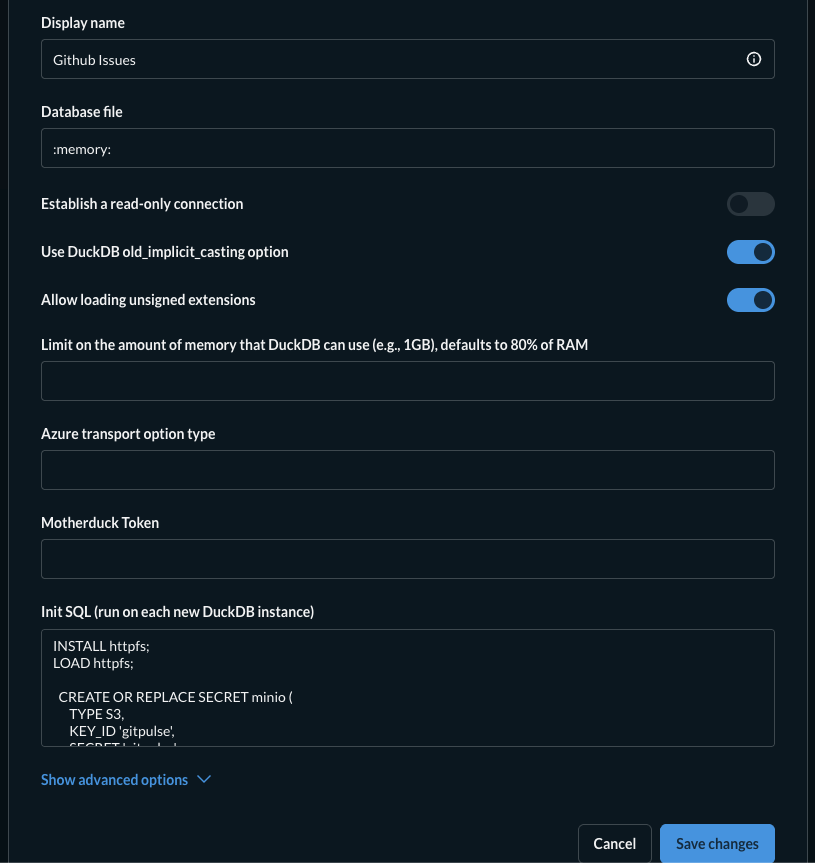

# GitPulse

GitHub issue backlog analytics pipeline. Answers one question: **is the open issue backlog growing or shrinking?**

Bronze → Silver → Gold → Metabase, all on your laptop.

---

## Stack

| Layer | Tech |
|-------|------|
| Ingestion | Python 3.12 + GitHub REST API |
| Storage | MinIO (S3-compatible, local Docker) |
| Format | Parquet (hive-partitioned) |
| Transforms | DuckDB + httpfs |
| Dashboard | Metabase v0.57.6 + MotherDuck DuckDB driver v1.4.3.1 |
| Runtime | uv |
| Infra | Docker Compose |

---

## Quick start

### 1. Prerequisites

- Docker Desktop
- [uv](https://docs.astral.sh/uv/getting-started/installation/)
- A GitHub personal access token

### 2. Environment

```bash
cp .env.example .env
# then edit .env and fill in GITHUB_TOKEN
```

Key variables:

```
GITHUB_TOKEN=ghp_...           # required
REPO_OWNER=apache              # default
REPO_NAME=airflow              # default
MINIO_ENDPOINT=localhost:9000
MINIO_ACCESS_KEY=gitpulse
MINIO_SECRET_KEY=gitpulse
MINIO_BUCKET=gitpulse
DUCKDB_FILE=/tmp/gitpulse.duckdb
```

### 3. Start infrastructure

```bash
docker compose up -d minio minio-init
```

MinIO console → http://localhost:9001 (user/password: `gitpulse`)

### 4. Run the pipeline

```bash
# Bronze: fetch raw issues from GitHub → MinIO Parquet
uv run python src/bronze/extract_issues.py

# Silver: deduplicate + flatten → MinIO Parquet
uv run python src/silver/process_bronze_to_silver.py

# Gold: build dashboard marts → MinIO Parquet
uv run python src/gold/build_gold_marts.py
```

---

## MinIO bucket layout

```
s3://gitpulse/
  bronze/github/issues/
    repo_owner=apache/repo_name=airflow/
      extraction_date=2026-03-08/
        page_001.parquet  ...  manifest.json

  silver/
    issue_current/repo_owner=apache/repo_name=airflow/data.parquet
    issue_labels/repo_owner=apache/repo_name=airflow/data.parquet
    issue_assignees/repo_owner=apache/repo_name=airflow/data.parquet
    sync_state/data.parquet

  gold/
    mart_issue_lifecycle/repo_owner=apache/repo_name=airflow/data.parquet
    mart_issue_daily_flow/repo_owner=apache/repo_name=airflow/data.parquet
    mart_issue_closure_age_monthly/repo_owner=apache/repo_name=airflow/data.parquet
    mart_issue_weekday_rhythm/repo_owner=apache/repo_name=airflow/data.parquet
    mart_issue_swing_days/repo_owner=apache/repo_name=airflow/data.parquet
```

---

## Metabase setup

### Start

```bash
docker compose up -d metabase
```

UI → http://localhost:3000 (takes ~30s to start)

Complete the Metabase onboarding wizard. When asked to add a database, skip it — add it manually afterward from **Settings → Databases → Add database**.

### Connect DuckDB

Select **DuckDB** as the database type and fill in the fields as shown:



| Field | Value |
|-------|-------|
| Display name | `Github Issues` (or anything) |
| Database file | `:memory:` |
| Establish a read-only connection | off |
| Allow loading unsigned extensions | **on** |
| Init SQL | *(see below)* |

**Init SQL** — paste this in full:

```sql
INSTALL httpfs;
LOAD httpfs;

CREATE OR REPLACE SECRET minio (
    TYPE S3,
    KEY_ID 'gitpulse',
    SECRET 'gitpulse',
    ENDPOINT 'minio:9000',
    USE_SSL false,
    URL_STYLE 'path'
);

-- Silver views
CREATE OR REPLACE VIEW silver_github_issue_current AS
    SELECT * FROM read_parquet('s3://gitpulse/silver/issue_current/**/*.parquet', hive_partitioning=true, union_by_name=true);
CREATE OR REPLACE VIEW silver_github_issue_labels AS
    SELECT * FROM read_parquet('s3://gitpulse/silver/issue_labels/**/*.parquet', hive_partitioning=true, union_by_name=true);
CREATE OR REPLACE VIEW silver_github_issue_assignees AS
    SELECT * FROM read_parquet('s3://gitpulse/silver/issue_assignees/**/*.parquet', hive_partitioning=true, union_by_name=true);
CREATE OR REPLACE VIEW silver_github_issue_sync_state AS
    SELECT * FROM read_parquet('s3://gitpulse/silver/sync_state/**/*.parquet', hive_partitioning=true, union_by_name=true);

-- Gold views
CREATE OR REPLACE VIEW gold_mart_issue_lifecycle AS
    SELECT * FROM read_parquet('s3://gitpulse/gold/mart_issue_lifecycle/**/*.parquet', hive_partitioning=true, union_by_name=true);
CREATE OR REPLACE VIEW gold_mart_issue_daily_flow AS
    SELECT * FROM read_parquet('s3://gitpulse/gold/mart_issue_daily_flow/**/*.parquet', hive_partitioning=true, union_by_name=true);
CREATE OR REPLACE VIEW gold_mart_issue_closure_age_monthly AS
    SELECT * FROM read_parquet('s3://gitpulse/gold/mart_issue_closure_age_monthly/**/*.parquet', hive_partitioning=true, union_by_name=true);
CREATE OR REPLACE VIEW gold_mart_issue_weekday_rhythm AS
    SELECT * FROM read_parquet('s3://gitpulse/gold/mart_issue_weekday_rhythm/**/*.parquet', hive_partitioning=true, union_by_name=true);
CREATE OR REPLACE VIEW gold_mart_issue_swing_days AS
    SELECT * FROM read_parquet('s3://gitpulse/gold/mart_issue_swing_days/**/*.parquet', hive_partitioning=true, union_by_name=true);
```

> **Note:** `ENDPOINT` uses `minio:9000` (Docker service name), not `localhost:9000`. Both Metabase and MinIO run in the same Docker network.

> **Note:** `Allow loading unsigned extensions` must be **on** — `httpfs` is an unsigned extension.

---

## Architecture notes

- No Airflow yet — all stages run as manual Python scripts
- Metabase uses `:memory:` DuckDB + Init SQL that reads Parquet directly from MinIO via httpfs on every connection
- The `Dockerfile.metabase` uses `eclipse-temurin:21-jre-jammy` (Ubuntu/glibc) instead of the official Metabase Alpine image because DuckDB's native library requires glibc and is incompatible with Alpine's musl libc

---

## Gold marts reference

| Mart | Grain | Powers |
|------|-------|--------|
| `gold_mart_issue_lifecycle` | one row per issue | issue drilldown, label/assignee breakdowns |
| `gold_mart_issue_daily_flow` | one row per repo per date | hero chart (opened vs closed over time) |
| `gold_mart_issue_closure_age_monthly` | one row per repo per month | median/p90 closure age, speed trends |
| `gold_mart_issue_weekday_rhythm` | one row per repo per weekday per event | day-of-week opening/closing patterns |
| `gold_mart_issue_swing_days` | one row per repo per date | biggest intake-pressure and cleanup-burst days |
